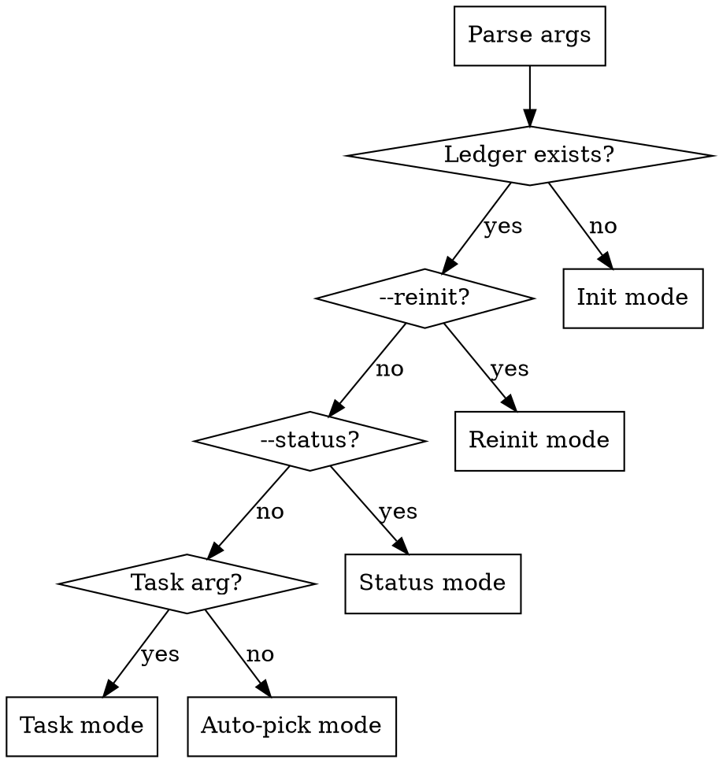
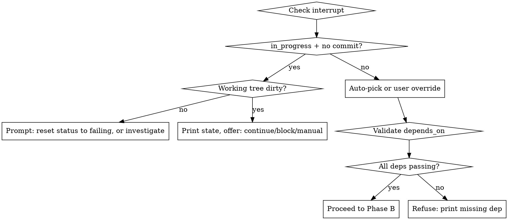

# opi-implement

Long-running-agent harness that drives `docs/opi-spec.md` implementation, plus
reviewed supplemental product-hardening specs listed in this skill, one task at
a time with TDD, tiered verification, and JSON-ledger checkpointing.

This is a **harness**, not a coding assistant. It encodes opinions about state,
evidence, failure recovery, and escalation. It does NOT edit `opi-spec.md`,
push commits, publish crates, or make network calls to providers.

**Spec alignment rule:** Before executing any task whose `phase >= current_phase`,
compare each entry in the ledger `spec_files_sha256` map with the current hash
of the corresponding file in `spec_files`. If any entry differs, refuse task
execution and direct the user to `opi-implement --reinit`. Status-only commands
(`--status`) remain available. Phase 1/2 retries that fall below `current_phase`
are allowed because their `Opi-DoD-SHA256` commit footers are the authoritative
contract for shipped work. Do not run stale ledger tasks whose title or DoD
contradicts the current spec.

**Supplemental Phase 5 sources:** Phase 5 productized extension/package tasks
are sourced from `docs/superpowers/specs/2026-06-08-productized-extensions-package-ecosystem-design.md`
and the reviewed implementation plan
`docs/superpowers/plans/2026-06-08-productized-extensions-package-ecosystem.md`.
When a Phase 5 ledger is initialized or reconciled, both files MUST be included
in `spec_files` and hashed in `spec_files_sha256` alongside `docs/opi-spec.md`.
Do not auto-parse arbitrary specs from `docs/superpowers/specs/`.

**Product-loop integrity rule:** A phase is not complete merely because every
component task is green. When a source spec contains goals, success criteria,
exit criteria, or user workflows, init/reinit MUST map them into executable
`acceptance_scenarios`. Every scenario needs an owning task, verification
command/test, and production call-site trace when it claims runtime behavior.
If a task proves only a helper, parser, protocol type, or bridge object without
showing that production startup/CLI/runtime calls it, mark it as substrate
coverage only; do not let it close a product acceptance scenario.

**DoD precision rule:** Vague verbs in a DoD (`works`, `supports`, `loads`,
`integrates`, `bridges`, `productizes`, `handles`) MUST be expanded during
init/reinit or task-graph review into concrete observable assertions:
command/API entry point, persisted artifact, production call site, runtime
effect, diagnostics, and negative/error behavior where relevant. A vague DoD is
not executable until expanded or explicitly accepted as a substrate-only task.

## Invocation

```text
opi-implement                                  # auto-pick next unblocked task
opi-implement <task-id>                        # specific task (validates deps)
opi-implement --status                         # print ledger summary
opi-implement --reinit                         # re-parse spec, reconcile
opi-implement <task-id> --resume-from-manual   # verify a manual commit
opi-implement <task-id> --extend-cap <N>       # raise iteration cap
opi-implement --clear-blocker <id> --because <text>  # unblock a task
```

## Mode Detection



**Auto-pick rule:** Lowest task ID (lexicographic, numerically aware) whose
`status` is `failing` AND every `depends_on` entry is `passing`. A dependency
is satisfied if it appears as `passing` in the active `tasks` array OR in any
`phase_exit[*].task_summary` entry. Tasks with `status: blocked` are skipped
until `--clear-blocker`.

**User-override rule:** Refuse if any `depends_on` is not satisfied by the
active tasks or archived phase summaries; print which dep is missing.

## Six Phases Per Invocation

Phases A, B, F are cheap and always execute. C and D are the work body.
E is the only phase that mutates git **during normal task execution**.
(Init and reinit also commit tracked harness files — see `references/initializer.md`.)

1. **Phase A: Bootstrap**
   - A.1 Detect mode (init / status / reinit / task / auto)
   - A.2 Load or create `.opi-impl-state.json`
   - A.3 Session ritual: `pwd`, `git status`, `git log -5 --oneline`, smoke
   - A.4 Select target task (auto-pick or validate override)

2. **Phase B: Plan-the-task**
   - B.1 Print task DoD + verification tier + parallelize plan + owned
     acceptance scenarios + required production call-site traces
   - B.2 User gate: "proceed with task `<id>` and create the one task commit if verification passes?"
   - B.3 If confirmed: mark `in_progress`, record `start_commit`, write ledger

3. **Phase C: Implement**
   - C.1 Invoke `superpowers:test-driven-development` (red→green→refactor)
     - If `parallelize` non-empty → `superpowers:dispatching-parallel-agents`
   - C.1a If implementation requires modifying files outside
     `tasks[].task_owned_paths`, the harness MUST append the new glob to
     `task_owned_paths` and record an `inference_notes` entry
     (`field = "task_owned_paths"`, `reason = "<why>"`) via the atomic ledger
     write BEFORE the file is edited. Append is the only Phase C mutation of a
     const field; it never silently expands ownership.
   - C.2 Iteration cap 3 → invoke `superpowers:systematic-debugging`
   - C.3 Total cap 5 → failure decision gate

4. **Phase D: Verify**
   - D.0 Product acceptance checks:
     - Run every `acceptance_scenarios` verification owned by the task.
     - For runtime/startup/CLI claims, prove the production call site exists and
       is exercised by the scenario. A direct helper/unit test is not enough.
     - If the scenario cannot be exercised yet, the task may pass only as
       substrate coverage and must leave the scenario open on a later vertical
       slice task.
   - D.1 Tier-specific mechanical gates
   - D.2 Task-level risk evaluator (when `evaluator_required = true`)
   - D.3 Cross-cutting gates: fmt, clippy, doc, smoke
   - D.4 If any fail → back to Phase C

5. **Phase E: Commit & Ledger Update**
   - E.1 Conventional commit with `Opi-*` evidence footers
   - E.2 Capture HEAD SHA + evidence → ledger
   - E.3 Flip status to `passing`; append session_note
   - E.4 No push (push is separate human action)

6. **Phase F: Phase-Exit Check**
   - F.1 If all phase tasks passing → run phase-exit evaluator
   - F.1a Phase-exit evaluator MUST rebuild the source spec's success/exit
     criteria from the current spec files, inspect code/tests independently of
     ledger claims, and produce a criteria trace with one of:
     `met`, `deferred-by-updated-design`, or `not-met`.
   - F.1b REFUSE phase archive when any criterion is `not-met`, or when
     `deferred-by-updated-design` lacks an exact source citation from the
     current spec/plan.
   - F.2 Print phase-complete report; no auto-release
   - F.3 Else → print "next unblocked: X.Y" hint
   - F.4 If F.1 passed, run the archive gate:
     - F.4a User gate: "Archive phase `<N>` ledger to
       `docs/snapshots/phase<N>/opi-impl-state.json` and compact `tasks` array
       into `phase_exit[<N>].task_summary`?"
     - F.4b If confirmed: write snapshot file, mutate ledger via atomic
       protocol (move completed tasks into `task_summary`, set `snapshot_path`,
       remove from active `tasks` array), commit ONLY the new snapshot file
       with message `chore: archive opi-implement phase <N> ledger snapshot`.
     - F.4c If declined: leave tasks array intact; no snapshot written.

**When init/reinit runs:** Read `references/initializer.md` for the full flow.

**When Phase D runs:** Read `references/verification-tiers.md` for gate details.

**When iteration cap hits:** Read `references/failure-gate.md` for the protocol.

## Task Selection



## Composition With Sub-Skills

| Phase | Skill | Purpose |
|---|---|---|
| C.1 | `superpowers:test-driven-development` | red→green→refactor body |
| C.1 | `superpowers:dispatching-parallel-agents` | when `parallelize` non-empty |
| C.2 | `superpowers:systematic-debugging` | attempt 3+ can't reach green |
| D.2 | code-reviewer subagent OR `superpowers:requesting-code-review` | independent evaluator for risk-gated tasks |
| D pre-commit | `superpowers:verification-before-completion` | evidence-before-claim |
| Failure (b) | `superpowers:brainstorming` | DoD interpretation ambiguous |

Each invocation announces itself:
`"Using superpowers:test-driven-development to drive red-green for task 1.6"`

## Parallel Sub-Unit Contract

When `parallelize` is non-empty:
- Sub-agents work on disjoint files; MUST NOT create commits
- Parent applies results in ledger order, runs full verification after each merge
- Completion events may arrive out of order; persisted evidence uses `parallelize` array order
- Conflict or overlapping edit → fail attempt → normal debug/failure path

## Commit Evidence Format

Every successful task commit MUST include these parseable footers:

```text
Opi-Task: <id>
Opi-DoD-SHA256: <sha256 of definition_of_done>
Opi-Verification: <tier>; <short command/result summary>
Opi-Evaluator: <not-required | passed>
```

If the task owns any `acceptance_scenarios`, also include:

```text
Opi-Acceptance: <scenario ids>; <command/test/call-site evidence summary>
```

Commit type is derived from the ledger `commit_type` field (feat/fix/docs/etc).
Commit scope is the crate name. Example: `feat(opi-agent): implement agent_loop`

## Ledger Location & Safety

- Path: `.opi-impl-state.json` (gitignored, NEVER committed)
- Temp: `.opi-impl-state.json.tmp` (gitignored)
- Draft: `.opi-impl-state.draft.json` (gitignored)
- All writes use structured JSON APIs, never string concatenation
- Shared-workspace rule: capture the pre-task baseline dirty file set at Phase B.
  Verification and commit gates must stage only task-owned files and must not
  require unrelated pre-existing user changes to be cleaned.
- **When ledger manipulation needed:** Read `references/ledger-schema.md`

## Platform Detection

- Detect host via `OSTYPE`/`OS` env vars and shell type
- Linux/macOS: run `scripts/opi-impl-smoke.sh`
- Windows native PowerShell: run `scripts/opi-impl-smoke.ps1`
- Windows bash (Git Bash/MSYS/WSL): run `scripts/opi-impl-smoke.sh` with
  forward-slash paths
- SHA-256: use `sha256sum`, PowerShell `Get-FileHash`, Python, or Rust helper
- JSON manipulation: `jq` when present; fallback to PowerShell/Python
- Required: `cargo` (Rust ≥ 1.85), `git`
- NOT required: `gh` CLI (belongs to `opi-release`)

## Red Flags — STOP Immediately

These are the top violations this harness prevents. Full table with reasoning
in `references/anti-patterns.md`.

1. **Never delete or weaken tests to make them pass.** Fix the implementation.
2. **Never bypass clippy with crate-wide `#[allow]`.** Per-item with comment OK.
3. **Never self-grade verification.** Gates are mechanical (exit codes, grep).
4. **Never auto-accept TUI snapshot changes.** Require explicit user approval.
5. **Never clean/restore/discard user changes from failure gate.** Print
   candidate commands; let the human decide.
6. **Never satisfy DoD with stubs/TODOs.** Unless DoD explicitly says scaffolding.
7. **Never silently rewrite task graph metadata.** Graph is a reviewed contract.
8. **Never commit ledger files.** They are gitignored runtime state.
9. **Never skip `[workspace.dependencies]` for internal deps.** Lockstep versioning.
10. **Never run live provider tests.** They belong in `#[ignore]`-gated tests.
11. **Never close a product scenario with component-only tests.** Helper,
    parser, protocol, and bridge tests are substrate evidence until an
    end-to-end production path exercises them.
12. **Never mark an unused runtime integration as passing.** If a function such
    as startup registration, resolver loading, or state persistence has no
    production call site, the task remains open or substrate-only.
13. **Never archive a phase from ledger status alone.** Phase exit must trace
    current source-spec criteria to code and tests independently.
14. **Never let vague DoD verbs stand.** Expand them before execution or stop
    for task-graph review.

The skill refuses to act if any rule would be violated, even if the user
requests it during a failure-decision gate.

## Status Mode (`--status`)

Print a summary table of all tasks:
- id, title, status, tier, depends_on (with pass/fail indicators)
- Current phase number
- Next unblocked task hint
- Any blocked tasks with blocker text
- Phase-exit status for completed phases

## Clear-Blocker Mode (`--clear-blocker <id> --because <text>`)

1. Validate task exists and `status = blocked`
2. Append `--because` text to `session_notes`
3. Clear `blocker` field
4. Set `status = failing`
5. Write ledger
6. Print confirmation + next-task hint

## Scope Boundaries (Never Cross)

- Editing `docs/opi-spec.md` except for a reviewed documentation/alignment task
  whose DoD explicitly owns `docs/opi-spec.md` and its localized counterpart
- Pushing commits or tags to `origin`
- Publishing to crates.io
- Building cross-platform binaries
- Network calls to any provider API
- Opening GitHub issues, PRs, or releases
- Reading/writing user runtime data such as `~/.config/opi/`, real auth files,
  or real session storage. Editing source code for config/session behavior is
  allowed only when the selected spec task owns that behavior.

## Design Spec

Full design rationale: `docs/superpowers/specs/2026-05-20-opi-implement-skill-design.md`

Supplemental Phase 5 design: `docs/superpowers/specs/2026-06-08-productized-extensions-package-ecosystem-design.md`

Supplemental Phase 5 implementation plan: `docs/superpowers/plans/2026-06-08-productized-extensions-package-ecosystem.md`
